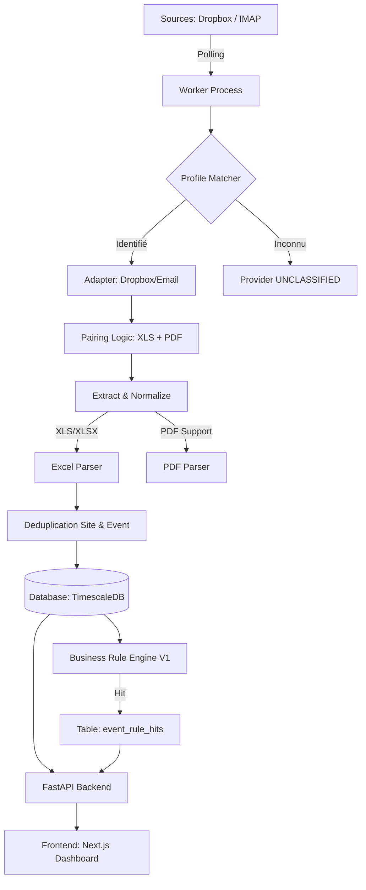

# Architecture du Pipeline d'Ingestion — TLS Supervision

## 1. Vue d'Ensemble
Le système est conçu comme un pipeline de traitement asynchrone capable de transformer des flux hétérogènes (Emails, Dropbox) en événements normalisés et alertes métier.

## 2. Flux de Données (Diagramme)

## 3. Composants du Pipeline

### 3.1 Watcher / Ingress
- **DropboxAdapter** : Surveille un dossier local synchronisé. Gère les sous-dossiers `done/`, `error/`, `unmatched/`.
- **EmailAdapter** : Se connecte via IMAP, utilise le bookmarking par **UID** pour garantir l'idempotence et ne traiter que les nouveaux messages.

### 3.2 Worker & Classification
- Le **Worker** tourne en boucle (`poll_cycle`).
- Le **ProfileMatcher** utilise des règles (regex sur le nom de fichier, domaine de l'expéditeur) pour affecter l'import à un `MonitoringProvider`.

### 3.3 Pairing & Intégrité
- **Appairage** : Si un message contient un XLS et un PDF, ils sont liés via `source_message_id`.
- **Integrity Check** : Le système compare les événements extraits du PDF avec ceux du XLS pour calculer un `match_pct`.

### 3.4 Parsing & Normalisation
- **ExcelParser** : Nettoie les wrappers Excel (`="..."`), normalise les `site_code` (suppression des zéros non significatifs).
- **PDFParser** : Extrait les données textuelles et détecte les actions opérateur.

### 3.5 Business Rule Engine (V1)
Déclenché après l'insertion en base, il évalue par lots les règles de :
- Intrusion (hors maintenance).
- Absence de test cyclique.
- Défauts techniques.
- Éjection (48h).
- Inhibition.

## 4. Garanties d'Idempotence
- **Fichiers** : Hashage MD5 du contenu pour éviter le double import.
- **Messages** : Tracking des `source_message_id`.
- **Événements** : Signature composite `(site_code, time, raw_code)`.

## 5. Scaling (Évolutivité)
Pour multiplier par 100 le volume traité :
- **CPU/IO** : Séparation du Worker en deux services (un pour le Parsing, un pour le Business Rule Engine) via une file de messages (ex: Redis Stream/RabbitMQ).
- **Bulk Insert** : Utilisation massive de `COPY` ou `INSERT ... ON CONFLICT DO NOTHING` par lots de 1000+.
- **Backpressure** : Limitation du nombre de messages IMAP récupérés par cycle pour éviter l'engorgement mémoire.
- **Indexation** : Partitionnement natif de TimescaleDB sur la colonne `time` pour maintenir des performances constantes sur des millions de lignes.
